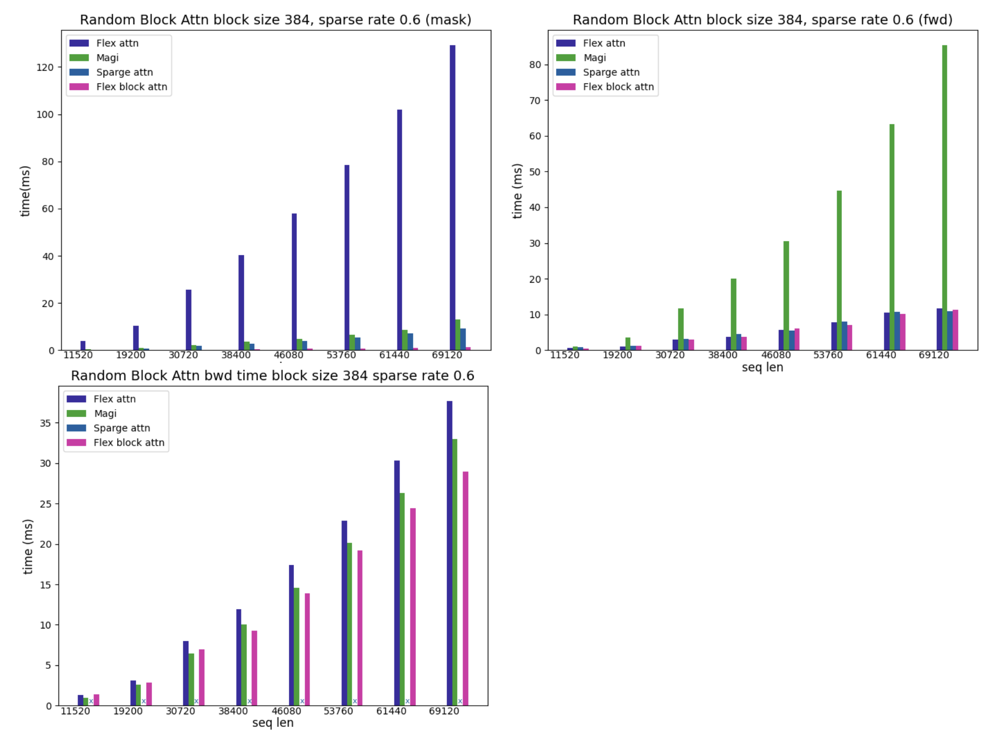
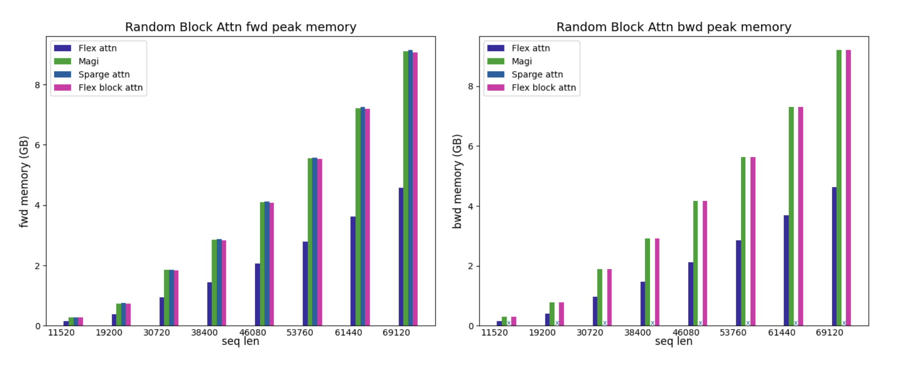
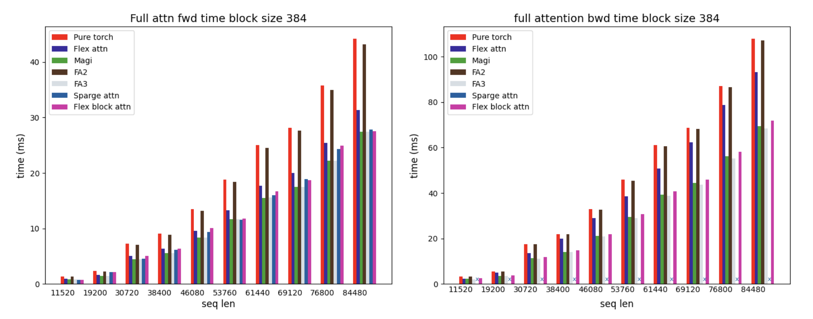
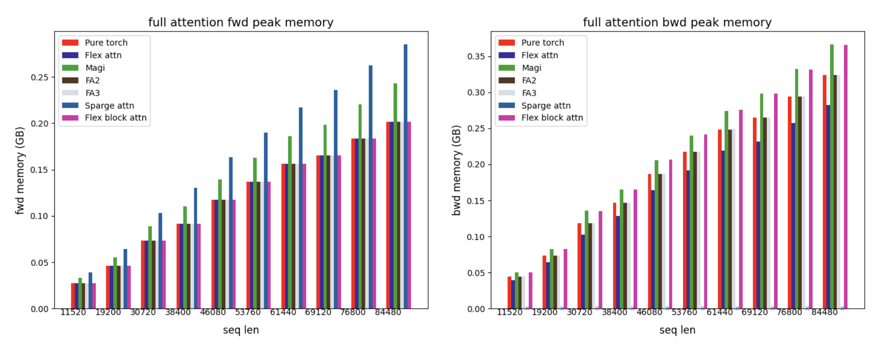

# Flex Block Attention

### Introduction
Flex-Block-Attn is an efficient block sparse attention communication library specifically designed for Hunyuan Video. It supports various sparse attention strategies including STA, MOBA, and SSTA (a hybrid of STA and MOBA) for both training and inference.Built upon ThunderKitten's attention demo implementation, this library delivers arbitrary sparse attention computation capabilities optimized for Hopper architecture GPUs. It features PyTorch-like mask expressions that ensure high usability while enabling efficient sparse mask generation.


### Project Updates
[2025-11-19] We have released the Flex-Block-Attn implementation along with comprehensive benchmark results. We welcome the community to test and provide feedback!

### 🛠️ Dependencies and Installation
 ```bash
 git submodule update --init --recursive
 python setup.py install
 ```

### 🔑 Usage
#### Custom kernel
```python
from flex_block_attn import flex_block_attn_func
from benchmark.utils.utils import create_sparse_mask
# take a (block_size * 2)*(block_size * 2) as an example
# block size can be 64,128,192...
'''[[0,1],
    [1,0]]'''
selected_blocks = [[0,1],[1,0]]
# create block mask with selected blocks
sparse_mask = create_sparse_mask(q, block_size, selected_blocks)
# sparse mask: torch.tensor([[0,1],[1,0]])
# for example if block_size=64, ths shape of torch mask is [128,128]
'''
[[0,0,0...,0],[1,1,1...,1],
 [0,0,0...,0],[1,1,1...,1],
 ...         , ...        ,
 [0,0,0...,0],[1,1,1...,1],
 [1,1,1...,1],[0,0,0...,0],
 [1,1,1...,1],[0,0,0...,0],
 ...         , ...        ,
 [1,1,1...,1],[0,0,0...,0],]
'''
#compute 
output = flex_block_attn_func(query, key, value, q_block_size, k_block_size, block_mask) 
```
#### SSTA kernel
SSTA is a novel attention mechanism that integrates the sparse attention of both Moba and STA. It has been utilized in both the training and inference processes of Hunyuan Video. We will be open-sourcing all related code in the near future – stay tuned!
### 🚀 Performance 
We provide performance comparisons in the **[benchmark](/benchmark/)**  folder, including measurements for mask creation time, forward/backward execution time, and GPU memory usage across the following attention types: full attention, sparse static attention, and sparse dynamic attention. Meanwhile, we have provided all the results(**[full attn](/benchmark/full/results/)**, **[static sparse attn](/benchmark/static/swa/results/)**, **[dynamic sparse attn](/benchmark/dynamic/random/results/)**) obtained from testing on the H20 GPU.
#### Dynamic Attention
in dynamic mask scenes, we display FlexBlockAttn speedup using these parameters:
* Sequence length 11520, 19200, 30720, 38400, 46080, 53760, 61440, 69120
* Block_size 384

#### sparse dynamic attention scenes
In sparse dynamic attention scenes, attention mask is generated randomly with a a specified sparsity ratio.We display FlexBlockAttn speedup using these parameters:
* Sequence length 11520, 19200, 30720, 38400, 46080, 53760, 61440, 69120
* Block_size 384
* Sparse rate 0.6

The performance(combined mask creation, forward and backward) of Flex Block Attention is better than mainstream sparse attention libraries.

##### Dynamic Attention Speedup


##### Dynamic Attention Memory


#### full attention scenes
In full attention scenes, the performance of Flex Block Attention is basically the same as FA3.

##### Full Attention Speedup


##### Full Attention Memory


### ❗️Notes
- The current dim must be 128
- q tile_size can be any multiple of 16, k/v tile_size can be any multiple of 64, with 384 recommended (as we have performed additional optimizations for this size)
- The current attention_mask only supports block-level masking. block_mask supports two shapes: [seq_len, seq_len] or [batch, head_num, seq_len, seq_len]

### 🙏 Acknowledgments

This project stands on the shoulders of the following amazing projects and resources. We extend our sincere gratitude to:

- **[ThunderKittens](https://github.com/HazyResearch/ThunderKittens)** : Our project extends its computational engine, building additional logic layers while leveraging its core calculation capabilities. The underlying computational power is entirely provided by its excellent infrastructure.
- **[MoBA](https://github.com/MoonshotAI/MoBA)**, **[STA(Sliding Tile Attention)](https://github.com/hao-ai-lab/FastVideo)**: In our video model training, we have drawn inspiration from the innovative contributions of these projects in sparse attention computation.
- **[flex attention](https://github.com/meta-pytorch/attention-gym)**, **[flash-attention](https://github.com/Dao-AILab/flash-attention)**, **[MagiAttention](https://github.com/SandAI-org/MagiAttention)**, **[SpargeAttn](https://github.com/thu-ml/SpargeAttn)**, **[Triton](https://github.com/triton-lang/triton)**: These projects have been pivotal in advancing efficient and flexible attention mechanisms and high-performance GPU programming. Their collective work in long-sequence processing, sparsity optimization, and providing efficient computational backends has been a crucial source of inspiration, performance benchmarking, and validation foundation for our design and implementation.


We are grateful to the entire open-source community for their invaluable contributions.

## 🔗Citation

If you use this codebase or otherwise find our work valuable, please cite:

```bibtex
@misc{flex_block_attn2025,
      title={flex-block-attn: an efficient block sparse attention communication library},
      author={},
      year={2025},
      publisher = {GitHub},
      howpublished = {\url{https://github.com/Tencent-Hunyuan/flex-block-attn}},
}
```
